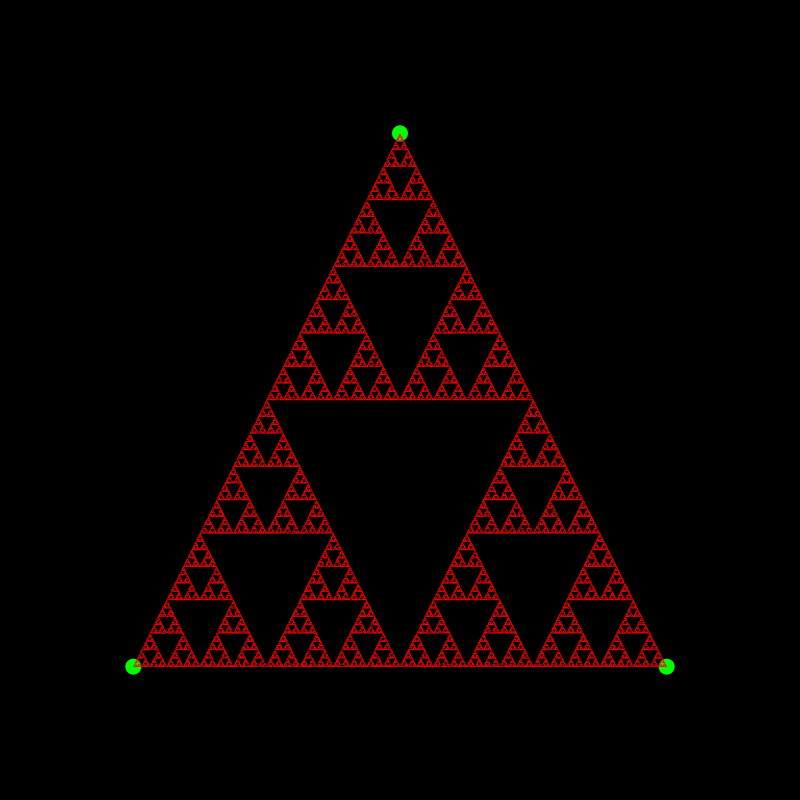

[Sierpiński triangle](https://en.wikipedia.org/wiki/Sierpiński_triangle) created using [Cairo](https://www.cairographics.org) in C

### Output


> Inspired from [Chaos Game - Numberphile](https://youtu.be/kbKtFN71Lfs)

# Building

Run the following command in terminal

```shell
gcc -l cairo -o main main.c
```

and then run the executable using

```shell
./main
```
